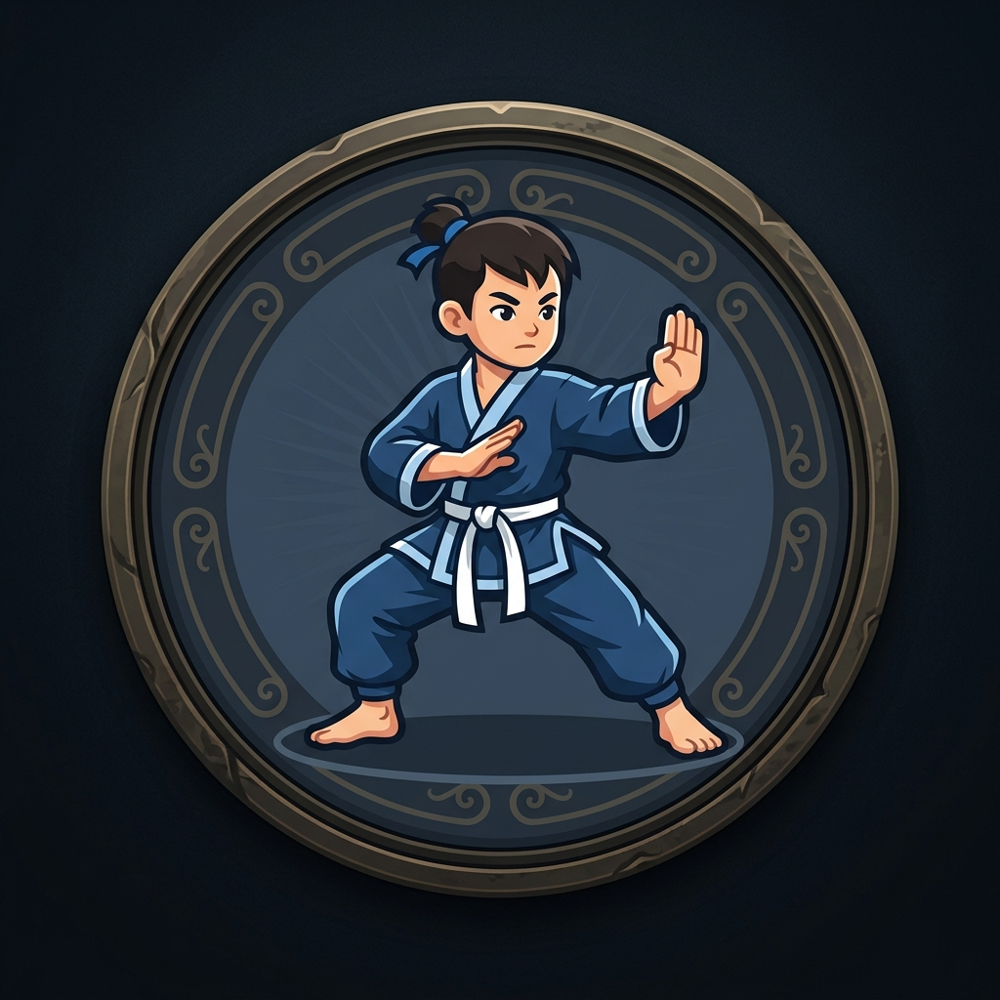

# Dojo Tactics 🥋

Um clone multiplayer em tempo real de um elegante jogo de tabuleiro estratégico 5x5, jogável diretamente no navegador!


## 🌐 Jogar Online

Você pode jogar a versão hospedada gratuitamente através do Render:  
👉 **[https://dojo-tactics.onrender.com](https://dojo-tactics.onrender.com)**

---

## 🎨 Artes e Identidade Visual

O jogo conta com artes exclusivas temáticas de artes marciais para representar os Discípulos (Monges) e os Mestres (Senseis) de cada jogador:

<p align="center">
  
  
  
  
</p>

---

## 🏗️ Arquitetura

Este projeto foi construído focando em ser **leve, rápido e em tempo real**, sem o uso de frameworks frontend complexos:

- **Backend (Python + FastAPI):** O cérebro do jogo. Possui um motor de regras puro (`engine.py`) que valida todos os movimentos (limites do tabuleiro 5x5, caminhos de vitória da Pedra e Riacho, e rotação das cartas). O `main.py` levanta o servidor HTTP e gerencia as conexões **WebSockets**, enviando o estado em tempo real (`JSON`) para os clientes conectados. Não utiliza banco de dados; todo o estado é mantido em memória RAM.
- **Frontend (HTML/CSS/Vanilla JS):** A interface é reativa, porém construída apenas com Javascript puro. Recebe os pacotes via WebSocket e renderiza o tabuleiro e as animações baseando-se no estado mestre do servidor. O design possui estética *Glassmorphism* moderna e layout responsivo.
- **Deploy Automático:** O arquivo `render.yaml` já está configurado para publicação grátis e automática na nuvem do Render.com.

## ✨ Funcionalidades
- **Multiplayer em Tempo Real:** Sincronização instantânea entre as abas.
- **Lobby e Histórico:** Lista de jogos em andamento e histórico detalhado das últimas partidas.
- **Modo Espectador:** Assista as partidas dos seus amigos em tempo real de forma "invisível" sem atrapalhar a jogabilidade.
- **Efeitos Sonoros & Responsividade:** Tudo ajustado para caber na tela do celular perfeitamente com efeitos dinâmicos de captura.

---

## 🚀 Como Rodar Localmente

Se você quiser rodar, modificar ou testar o jogo na sua própria máquina, o processo é muito simples:

### Pré-requisitos
- Ter o **Python 3.8+** instalado na sua máquina.

### Passo a passo
1. **Clone este repositório:**
   ```bash
   git clone https://github.com/IgorNascAlves/dojo-tactics.git
   cd dojo-tactics
   ```

2. **Crie um ambiente virtual (Recomendado):**
   ```bash
   python -m venv venv
   source venv/bin/activate  # No Linux/Mac
   # No Windows use: venv\Scripts\activate
   ```

3. **Instale as dependências:**
   ```bash
   pip install -r requirements.txt
   ```

4. **Inicie o servidor local:**
   ```bash
   cd backend
   uvicorn main:app --host 0.0.0.0 --port 8000
   ```

5. **Jogue:** Abra o seu navegador e acesse `http://localhost:8000`.

---

## 📜 Créditos

Este projeto open-source foi criado com os seguintes recursos:

* 🤖 **Código-Fonte:** O código de toda a arquitetura (Backend, Frontend, CSS e Engine) foi gerado **100% via IA** pelo **Antigravity**, o assistente de programação da equipe Google DeepMind.
* 🎨 **Artes Visuais:** As texturas (Monge e Sensei) foram geradas artificialmente também pela IA integrada do Antigravity.
* 🎵 **Efeitos Sonoros:** Os arquivos de áudio recomendados para a pasta `sounds/` foram obtidos de forma gratuita sob a licença da plataforma [Pixabay](https://pixabay.com/).
